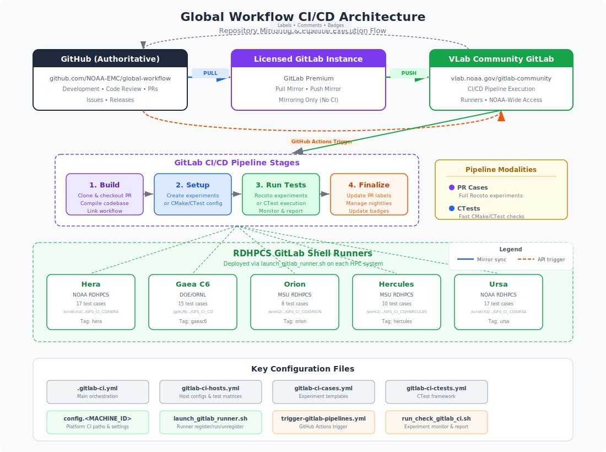

.. _ci-cd-pipeline:

#######################################
GitLab CI/CD Pipeline Infrastructure
#######################################

This document provides a comprehensive reference for the GitLab CI/CD pipeline
infrastructure used by the global-workflow project. It covers the repository
mirroring strategy between GitHub and GitLab, the pipeline architecture and
configuration, the GitLab runner deployment on RDHPCS systems, and the day-to-day
maintenance procedures that keep the system operational.

.. contents:: Table of Contents
   :depth: 3
   :local:

*********
Overview
*********

The global-workflow CI/CD system uses **GitLab CI/CD** as the execution engine for
continuous integration testing across NOAA's Research and Development High-Performance
Computing Systems (RDHPCS). GitHub remains the **authoritative repository** where all
development, code review, and pull request activity occurs.

The fundamental challenge this infrastructure solves is that NOAA's HPC systems
(Hera, Gaea, Orion, Hercules, Ursa) are not directly accessible from GitHub Actions
runners. By mirroring the repository to GitLab and placing GitLab runners directly
on those HPC systems, the project gains the ability to build and test the workflow
in the same environments where it will be deployed operationally.

   High-level CI/CD architecture showing repository mirroring and pipeline flow.

The architecture can also be summarized textually::

    ┌──────────────────────────┐         ┌───────────────────────────┐         ┌──────────────────────────┐
    │   GitHub (Authoritative) │  Pull   │  Licensed GitLab Instance │  Push   │  VLab Community GitLab   │
    │   github.com/NOAA-EMC/   │ Mirror  │  (Premium — Mirroring     │ Mirror  │  vlab.noaa.gov/          │
    │   global-workflow        ├────────►│   Only)                   ├────────►│  gitlab-community/...    │
    │                          │         │                           │         │  (CI/CD Pipelines here)  │
    └──────────┬───────────────┘         └───────────────────────────┘         └────────────┬─────────────┘
               │                                                                            │
               │  GitHub Actions                                               Pipeline Stages
               │  (API Trigger)                                                             │
               │                                                    ┌───────────────────────▼──────────┐
               │                                                    │  1. Build → 2. Setup → 3. Run →  │
               └───────────────────────────────────────────────────►│           4. Finalize            │
                                                                    └──────────────────┬───────────────┘
                                                                                       │
                           ┌───────────────────────────────────────────────────────────▼───────────┐
                           │        RDHPCS GitLab Shell Runners                                    │
                           │  ┌───────┐ ┌────────┐ ┌──────┐ ┌─────────┐ ┌──────┐                   │
                           │  │ Hera  │ │Gaea C6 │ │Orion │ │Hercules │ │ Ursa │                   │
                           │  │17 case│ │15 cases│ │8 case│ │10 cases │ │17 cas│                   │
                           │  └───────┘ └────────┘ └──────┘ └─────────┘ └──────┘                   │
                           └───────────────────────────────────────────────────────────────────────┘

Key Design Principles
=====================

- **GitHub is authoritative**: All development happens on GitHub
  (``https://github.com/NOAA-EMC/global-workflow``). GitLab is used solely as
  a CI execution platform.
- **Two-tier mirroring**: A licensed GitLab instance performs the pull mirror from
  GitHub, and subsequently push mirrors to the NOAA community GitLab instance.
- **HPC-native testing**: Runners execute directly on the target HPC nodes,
  ensuring tests build and run against the real Spack-Stack software environment.
- **Multi-modal pipelines**: The system supports both comprehensive end-to-end
  experiment cases and fast CTest-based functional checks.
- **GitHub feedback loop**: Pipeline results flow back to GitHub through PR labels,
  PR comments (including error log gists), and status badges.

*********************************************
Repository Mirroring: GitHub to GitLab
*********************************************

Because GitHub is the authoritative source of truth and GitLab is the CI execution
platform, a reliable synchronization mechanism is required. The global-workflow
project uses a **two-stage mirroring strategy** involving two GitLab instances.

Pull Mirroring (Licensed GitLab Instance)
==========================================

The first stage uses **pull mirroring**, a feature that is only available on
licensed (paid) tiers of GitLab (Premium or Ultimate). A single licensed GitLab
instance is configured to pull from the authoritative GitHub repository:

.. list-table:: Pull Mirror Configuration
   :widths: 25 75
   :header-rows: 1

   * - Setting
     - Value
   * - **Source repository**
     - ``https://github.com/NOAA-EMC/global-workflow.git``
   * - **Direction**
     - Pull
   * - **Scope**
     - All branches
   * - **Sync frequency**
     - Automatic (every few minutes)

The licensed instance's sole purpose is **mirroring** — it does not run any
CI/CD pipelines itself. Its pull mirror keeps the GitLab copy synchronized with
GitHub, and its push mirror (described below) propagates changes onward.

.. note::

   Pull mirroring is an **advanced feature** available only on licensed instances
   of GitLab (Premium tier and above). It is not available on GitLab Community
   Edition (CE) or the free tier. This is why a separate licensed instance is
   required for the first stage of the mirror chain.

Push Mirroring (Community GitLab at VLab)
=========================================

The second stage uses **push mirroring** from the licensed GitLab instance to
the NOAA community GitLab instance hosted at VLab:

.. list-table:: Push Mirror Configuration
   :widths: 25 75
   :header-rows: 1

   * - Setting
     - Value
   * - **Target repository**
     - ``https://vlab.noaa.gov/gitlab-community/NWS/Operations/NCEP/EMC/global-workflow.git``
   * - **Direction**
     - Push
   * - **Scope**
     - All branches
   * - **Sync frequency**
     - Automatic (every few minutes)

The VLab community GitLab instance is where the **CI/CD pipelines actually
execute**. GitLab runners deployed on RDHPCS systems register against this
instance, and all pipeline stages (build, setup, test, finalize) run here.
This instance also provides the broader NOAA user community with read access
to the repository.

Mirror Chain Summary
====================

The complete mirror chain is::

    GitHub (authoritative)
        │
        │  Pull Mirror (licensed GitLab feature)
        ▼
    Licensed GitLab Instance (mirroring only)
        │
        │  Push Mirror (available on all GitLab tiers)
        ▼
    VLab Community GitLab (CI/CD pipelines execute here, NOAA-wide access)

Both mirrored repositories track **all branches**, ensuring that any branch pushed
to GitHub (including PR branches fetched during pipeline execution) is available
for CI testing.

.. important::

   Developers should **never push directly** to either GitLab instance. All code
   changes must flow through GitHub. The GitLab mirrors are read-only copies
   maintained by the mirroring configuration.

*****************************
Pipeline Architecture
*****************************

The pipeline is defined across four YAML configuration files that are included
from the top-level ``.gitlab-ci.yml``:

.. list-table:: Pipeline Configuration Files
   :widths: 35 65
   :header-rows: 1

   * - File
     - Purpose
   * - ``.gitlab-ci.yml``
     - Main orchestration: stages, variables, base templates, build template
   * - ``dev/ci/gitlab-ci-cases.yml``
     - Templates for standard experiment test cases (setup, run, finalize)
   * - ``dev/ci/gitlab-ci-ctests.yml``
     - Templates for CTest-based functional testing (CMake/CTest)
   * - ``dev/ci/gitlab-ci-hosts.yml``
     - Host-specific jobs, test matrices, runner tags, and conditional rules

Pipeline Stages
===============

Every pipeline execution proceeds through four stages in order:

1. **build** — Clone the repository, checkout the PR branch (if applicable), build
   the codebase via ``ci_utils.sh build``, and link the workflow.
2. **setup_tests** — Prepare the test environment: create experiment directories
   (PR Cases) or configure the CMake/CTest build (CTests).
3. **run_tests** — Execute the tests: run Rocoto-orchestrated experiments
   (PR Cases) or run ``ctest`` with specific labels (CTests).
4. **finalize** — Report results: update GitHub PR labels, manage nightly
   directory symlinks, and update status badges.

Pipeline Modalities
===================

The ``PIPELINE_TYPE`` variable controls which testing modality runs:

PR Cases (``PIPELINE_TYPE=pr_cases``)
--------------------------------------

Comprehensive end-to-end experiment testing. Each test case is defined by a YAML
file in ``dev/ci/cases/pr/`` that specifies an experiment configuration:

.. code-block:: yaml

   # Example: dev/ci/cases/pr/C48_ATM.yaml
   experiment:
     net: gfs
     mode: forecast-only
     app: ATM
     resdetatmos: 48
     idate: 2021032312
     edate: 2021032312

   workflow:
     engine: rocoto
     rocoto:
       maxtries: 2

The pipeline creates a full experiment directory, launches Rocoto, and monitors
the workflow to completion. Failures are detected through Rocoto state tracking
and reported back to the GitHub PR with error log gists.

**Currently defined PR case tests include:**

- ``C48_ATM`` — Atmosphere-only forecast
- ``C48_S2SW`` — Coupled atmosphere-ocean-ice-wave
- ``C48_S2SWA_gefs`` — GEFS ensemble coupled run
- ``C48mx500_3DVarAOWCDA`` — 3DVar coupled data assimilation
- ``C48mx500_hybAOWCDA`` — Hybrid EnVar coupled data assimilation
- ``C96C48_hybatmDA`` — Hybrid atmosphere-only data assimilation
- ``C96C48_hybatmsnowDA`` — Hybrid atmosphere + snow data assimilation
- ``C96C48_hybatmsoilDA`` — Hybrid atmosphere + soil data assimilation
- ``C96_atm3DVar`` — C96 resolution 3DVar atmosphere
- ``C96_gcafs_cycled`` — GCAFS cycled system
- ``C96mx100_S2S`` — Seasonal-to-subseasonal coupled
- ``C48_gsienkf_atmDA`` — GSI ensemble Kalman filter
- ``C48_ufsenkf_atmDA`` — UFS ensemble Kalman filter
- And others (see ``dev/ci/gitlab-ci-hosts.yml`` for per-machine matrices)

CTests (``PIPELINE_TYPE=ctests``)
----------------------------------

Fast, focused unit-level testing using the CMake/CTest framework. These tests
exercise individual Rocoto jobs (JJOBS) with predefined, pre-staged input data
and verify their outputs against baselines from nightly stable runs. CTests
provide rapid developer feedback (minutes instead of hours) and are ideal for
targeted validation of specific job changes.

For full details on the CTest framework — including test case configuration, YAML
definitions, running tests, validation modes, and adding new tests — see
:doc:`testing`.

Per-Host Test Matrices
======================

Each HPC platform runs a specific subset of test cases. Not every platform
supports every test — the matrix for each machine is determined by software
availability (e.g., Spack-Stack module coverage), data staging (initial
conditions and baseline outputs), and platform-specific limitations (e.g.,
TC Tracker not available on Hercules, GSI performance issues on Orion).

Test matrices are defined as YAML anchors in ``dev/ci/gitlab-ci-hosts.yml``,
one per platform. Each anchor lists the ``caseName`` values that platform will
run:

.. code-block:: yaml

   # Example from dev/ci/gitlab-ci-hosts.yml
   .hera_cases_matrix: &hera_cases
     - caseName: ["C48_ATM", "C48_S2SW", "C48_S2SWA_gefs", ...]

   .orion_cases_matrix: &orion_cases
     - caseName: ["C48_ATM", "C48_S2SW", ...]

These anchors are referenced by the per-host job definitions in the same file.
To add or remove a test case from a platform, edit the corresponding anchor
array. The authoritative source for which tests run where is always
``dev/ci/gitlab-ci-hosts.yml`` — do not duplicate this information elsewhere.

Additionally, individual test case YAML files in ``dev/ci/cases/pr/`` can
declare a ``skip_ci_on_hosts`` list to exclude themselves from specific
platforms without modifying the host matrix:

.. code-block:: yaml

   # Example: dev/ci/cases/pr/C48_ATM_ecflow.yaml
   skip_ci_on_hosts:
     - wcoss2
     - hera
     - orion

This is useful when a test case is defined globally but should not run on
certain hosts — for example, a workflow engine that is only supported on a
subset of platforms. The pipeline checks this list at runtime and skips the
case on any matching host.

Pipeline Variables
==================

The following variables control pipeline behavior and can be set from
GitLab scheduled pipelines, GitHub Actions triggers, or the GitLab web UI:

.. list-table:: Key Pipeline Variables
   :widths: 25 15 60
   :header-rows: 1

   * - Variable
     - Default
     - Description
   * - ``PIPELINE_TYPE``
     - ``pr_cases``
     - Testing modality: ``pr_cases`` or ``ctests``
   * - ``GFS_CI_RUN_TYPE``
     - ``pr_cases``
     - Run classification: ``pr_cases`` or ``nightly``
   * - ``RUN_ON_MACHINES``
     - ``all``
     - Space-separated list of machines or ``all``
   * - ``PR_NUMBER``
     - ``0``
     - GitHub PR number (``0`` = develop branch)
   * - ``GITHUB_COMMIT_SHA``
     - (empty)
     - PR head commit SHA for GitLab native GitHub integration
   * - ``GW_REPO_URL``
     - ``https://github.com/NOAA-EMC/global-workflow.git``
     - Authoritative GitHub repository URL

*********************************************
GitHub Actions Integration
*********************************************

Pipelines are triggered from GitHub via the ``trigger-gitlab-pipelines.yml``
workflow in ``.github/workflows/``. This provides a user-friendly interface
for developers to initiate CI testing.

Triggering a Pipeline
=====================

1. Navigate to the **Actions** tab in the GitHub repository.
2. Select the **"Trigger GitLab Pipelines"** workflow.
3. Click **"Run workflow"** and configure the inputs:

   - **PR number**: Enter the PR number to test, or ``0`` for the develop branch.
   - **Pipeline Type**: Choose "PR Cases" or "CTests".
   - **Machine checkboxes**: Select which RDHPCS machines to run on (Hera,
     Gaea C6, Orion, Hercules, Ursa).

4. Click **"Run workflow"** to submit.

The workflow performs the following:

1. **Permission check**: Verifies the triggering user is in the
   ``AUTHORIZED_GITLAB_TRIGGER_USERS`` list (stored as a GitHub repository variable).
2. **Parameter setup**: Resolves the PR head commit SHA, determines the pipeline
   type, and builds the machine selection list.
3. **GitLab trigger**: Sends a POST request to the GitLab Pipeline Trigger API
   with all the necessary variables.
4. **Label management**: Adds ``CI-<Machine>-Ready`` labels to the PR on GitHub.

Required GitHub Secrets and Variables
=====================================

.. list-table:: GitHub Configuration
   :widths: 25 15 60
   :header-rows: 1

   * - Name
     - Type
     - Description
   * - ``GITLAB_TRIGGER_TOKEN``
     - Secret
     - GitLab pipeline trigger token (Settings > CI/CD > Pipeline triggers)
   * - ``GITHUBTOKEN``
     - Secret
     - GitHub personal access token with repo scope
   * - ``GW_REPO_URL``
     - Variable
     - GitHub repository URL (e.g., ``NOAA-EMC/global-workflow``)
   * - ``GITLAB_TRIGGER_URL``
     - Variable
     - GitLab trigger API endpoint URL
   * - ``AUTHORIZED_GITLAB_TRIGGER_USERS``
     - Variable
     - Comma-separated list of authorized GitHub usernames

PR Label Lifecycle
==================

GitHub PR labels track the CI state through the pipeline:

.. list-table:: CI Label Flow
   :widths: 25 15 60
   :header-rows: 1

   * - Label
     - Set By
     - Meaning
   * - ``CI-<Machine>-Ready``
     - GitHub Actions
     - Pipeline has been triggered for this machine
   * - ``CI-<Machine>-Building``
     - Build stage
     - Build is in progress
   * - ``CI-<Machine>-Running``
     - Build stage (on success)
     - Tests are actively running
   * - ``CI-<Machine>-Passed``
     - Finalize (success)
     - All test cases passed on this machine
   * - ``CI-<Machine>-Failed``
     - Finalize (failure)
     - One or more test cases failed

When a test case fails, the ``run_check_gitlab_ci.sh`` script automatically posts
a comment to the GitHub PR containing:

- The failed case name and machine
- The experiment directory path
- Links to error log gists (uploaded via ``publish_logs.py``)

*****************************
Nightly Pipeline Operations
*****************************

Nightly pipelines are configured as **GitLab scheduled pipelines** with
``GFS_CI_RUN_TYPE=nightly``. They differ from PR-triggered pipelines in several
ways:

Directory Management
====================

On successful completion of a nightly pipeline:

1. The workspace directory is renamed from the pipeline-ID format to a date-based
   format::

       # During execution:
       ${CI_BUILDS_DIR}/nightly_${CI_COMMIT_SHORT_SHA}_${CI_PIPELINE_ID}/

       # After success:
       ${CI_BUILDS_DIR}/nightly_${CI_COMMIT_SHORT_SHA}_${MMDDYY}/

2. A ``stable`` symlink is created pointing to the latest successful nightly::

       ${CI_BUILDS_DIR}/stable -> nightly_${CI_COMMIT_SHORT_SHA}_${MMDDYY}/

3. Old nightly directories (except the stable target) are cleaned up.

The ``stable`` directory is significant because CTest baseline data
(``STAGED_CTESTS``) is sourced from it:

.. code-block:: bash

   export STAGED_CTESTS=${GITLAB_BUILDS_DIR}/stable/RUNTESTS

Badge Updates
=============

Nightly pipelines update status badges stored as GitHub Gists. On success, a
green "passed" badge is generated; on failure, a red "failed" badge is generated.
These badges are referenced from the project README for visibility.

.. code-block:: bash

   # Badge generation (from finalize stage)
   curl -sSL "https://img.shields.io/badge/${machine}_nightly-passed-brightgreen" \
     -o "${badge_img_file}"
   ${GH} gist edit "${badge_GIST_ID}" --add "${badge_img_file}"

*****************************
GitLab Runner Setup
*****************************

GitLab runners are deployed directly on each RDHPCS system. They execute as
**shell runners** (not Docker), running directly in the HPC environment with
access to the native compilers, Spack-Stack modules, and shared filesystems.

Platform Configuration Files
=============================

Each supported platform has a configuration file at
``dev/ci/platforms/config.<MACHINE_ID>`` that defines platform-specific paths
and settings:

.. list-table:: Platform Configurations
   :widths: 15 35 50
   :header-rows: 1

   * - Platform
     - Config File
     - CI Root Directory
   * - Hera
     - ``config.hera``
     - ``/scratch3/NCEPDEV/global/role.glopara/GFS_CI_CD/HERA``
   * - Gaea C6
     - ``config.gaeac6``
     - ``/gpfs/f6/drsa-precip3/proj-shared/${USER}/GFS_CI_CD``
   * - Orion
     - ``config.orion``
     - ``/work2/noaa/global/${USER}/GFS_CI_CD/ORION``
   * - Hercules
     - ``config.hercules``
     - ``/work2/noaa/global/role-global/GFS_CI_CD/HERCULES``
   * - Ursa
     - ``config.ursa``
     - ``/scratch3/NCEPDEV/global/role.glopara/GFS_CI_CD/URSA``
   * - WCOSS2
     - ``config.wcoss2``
     - ``/lfs/h2/emc/global/noscrub/globalworkflow.ci/GFS_CI_ROOT``

Each configuration file exports the following key variables:

.. code-block:: bash

   # Base directory for all CI operations
   export GFS_CI_ROOT=/scratch3/NCEPDEV/global/role.glopara/GFS_CI_CD/HERA

   # Initial condition data for experiments
   export ICSDIR_ROOT=/scratch3/NCEPDEV/global/role.glopara/data/ICSDIR

   # GitLab runner registration URL
   export GITLAB_URL=https://vlab.noaa.gov/gitlab-community

   # Human-readable runner name
   export GITLAB_RUNNER_NAME="RDHPCS Hera"

   # Directory where pipeline builds are stored
   export GITLAB_BUILDS_DIR=${GFS_CI_ROOT}/BUILDS/GITLAB

   # GitLab runner working directory (state files, config)
   export GITLAB_RUNNER_DIR="${GFS_CI_ROOT}/GitLab/Runner"

   # Baseline data for CTests
   export STAGED_CTESTS=${GITLAB_BUILDS_DIR}/stable/RUNTESTS

   # Custom Rocoto path (dry-run capable build)
   export GFS_CI_ROCOTO_PATH="${GFS_CI_UTIL_PATH}/src/rocoto-1.3.7-dryrun_nodaemon/bin"

.. note::

   Hera and Ursa share the same physical filesystem (cross-mounted), so their
   ``GFS_CI_ROOT`` paths include the machine name (``HERA`` or ``URSA``) to
   avoid collisions.

The ``launch_gitlab_runner.sh`` Script
======================================

The ``dev/ci/scripts/utils/gitlab/launch_gitlab_runner.sh`` script is the primary
tool for managing GitLab runners on each RDHPCS system. It supports four
operations: **register**, **run**, **unregister**, and **status**.

The ``run`` command is **idempotent** — it performs a 3-tier health check and
only (re)launches the runner if it is unhealthy or offline. This makes it safe
to call from a cron job for automated recovery without risking duplicate
processes.

Setup Prerequisites
-------------------

Before using the launch script, ensure:

1. **Platform config exists**: A ``config.<MACHINE_ID>`` file must exist in
   ``dev/ci/platforms/`` for the target machine.
2. **Runner token is available**: The GitLab runner registration token must be
   available through one of:

   - Command-line argument (second positional parameter)
   - ``GITLAB_RUNNER_TOKEN`` environment variable
   - A ``gitlab_token`` file in the runner directory

3. **Runner binary**: The script will automatically download the GitLab runner
   binary if it is not present in the ``GITLAB_RUNNER_DIR``.

Registering a Runner
--------------------

To register a new runner on an RDHPCS system:

.. code-block:: bash

   # SSH to the target HPC system
   ssh role.glopara@hera.rdhpcs.noaa.gov

   # Navigate to the global-workflow checkout
   cd /path/to/global-workflow

   # Register the runner (token can also be in GITLAB_RUNNER_TOKEN or gitlab_token file)
   dev/ci/scripts/utils/gitlab/launch_gitlab_runner.sh register <GITLAB_RUNNER_TOKEN>

Starting a Runner
-----------------

To start a registered runner:

.. code-block:: bash

   dev/ci/scripts/utils/gitlab/launch_gitlab_runner.sh run

The ``run`` command is idempotent. It first performs a 3-tier health check:

1. **Tier 1 — Process**: Is the ``gitlab-runner`` process alive? (``pgrep``)
2. **Tier 2 — Metrics**: Is the Prometheus metrics endpoint responding? (``curl``)
3. **Tier 3 — Server**: Can the runner reach the GitLab server? (``gitlab-runner verify``)

If all three tiers pass, the command exits immediately with no changes. If the
runner is offline or unhealthy, it waits 5 minutes (configurable) and re-checks
before relaunching to avoid reacting to transient network issues.

On launch, the runner starts as a background process using ``nohup`` with a
Prometheus metrics endpoint on ``localhost:${GITLAB_RUNNER_METRICS_PORT}``
(default 9252). A **state file** (``runner.state``) is written to the runner
directory recording the PID, metrics port, start time, and host node.

**Command-line flags:**

* ``-f`` — Force launch, skip all health checks
* ``-n`` — Skip the 5-minute wait period before relaunch

.. code-block:: bash

   # Normal idempotent run (safe for cron)
   dev/ci/scripts/utils/gitlab/launch_gitlab_runner.sh run

   # Force relaunch immediately
   dev/ci/scripts/utils/gitlab/launch_gitlab_runner.sh run -f

   # Skip wait period (useful in interactive sessions)
   dev/ci/scripts/utils/gitlab/launch_gitlab_runner.sh run -n

Checking Runner Status
-----------------------

To get a health report without taking any action:

.. code-block:: bash

   dev/ci/scripts/utils/gitlab/launch_gitlab_runner.sh status

This runs the same 3-tier health check as ``run`` and prints a summary:

.. code-block:: text

   Runner host: gaea51 (current node: gaea68, remote: True)
   Process alive: True (PID: 12345)
   Metrics endpoint: True (port: 9252)
   Server verified: True
   GitLab Runner is healthy (all 3 tiers passed)

Exit codes: ``0`` if all tiers pass, ``1`` otherwise.

Cross-Node Health Checks
-------------------------

On multi-head-node RDHPCS clusters (Hera, Ursa, Gaea), cron jobs can execute on
**any** login node, but the runner process and its metrics port are only visible
on the node where it was launched. The script handles this transparently:

1. When the runner launches, it records the host node in ``runner.state``.
2. On subsequent ``run`` or ``status`` calls, if the current node differs from
   the recorded host, the script SSH-es to the runner's node for Tier 1 and
   Tier 2 checks (passwordless SSH between head nodes is standard for service
   accounts).
3. Tier 3 (``gitlab-runner verify``) works from any node since it contacts the
   GitLab server directly.

This ensures that a cron-based health check on ``gaea68`` can correctly assess
a runner launched on ``gaea51``.

Unregistering a Runner
----------------------

To remove a runner from the GitLab server:

.. code-block:: bash

   dev/ci/scripts/utils/gitlab/launch_gitlab_runner.sh unregister

This removes the runner registration identified by ``${GITLAB_RUNNER_NAME}``
from the GitLab server.

Runner Directory Layout
=======================

Each platform follows a common directory structure under its ``GFS_CI_ROOT``:

::

    ${GFS_CI_ROOT}/
    ├── BUILDS/
    │   └── GITLAB/             # Pipeline build artifacts
    │       ├── pr_cases_<sha>_<id>/
    │       ├── nightly_<sha>_<date>/
    │       └── stable -> nightly_<sha>_<date>/
    └── GitLab/
        └── Runner/             # Runner working directory
            ├── gitlab-runner   # Runner binary
            ├── config.toml     # Runner configuration (auto-generated)
            ├── runner.state    # Runtime state (PID, port, host, start time)
            ├── gitlab_token    # Optional token file
            └── launched_gitlab_runner-*.log  # Runner logs

The ``runner.state`` file is written on each launch and contains:

.. code-block:: bash

   RUNNER_PID=12345
   RUNNER_METRICS_PORT=9252
   RUNNER_STARTED="2026-04-15 08:00:00"
   RUNNER_HOST=gaea51
   GITLAB_RUNNER_DIR=/gpfs/f6/drsa-precip3/proj-shared/user/GFS_CI_CD/GitLab/Runner

This file is sourced by subsequent ``run`` and ``status`` invocations to locate
the runner process across head nodes and determine the correct metrics port.

Runner Maintenance
==================

Automated Health Checks (Cron)
------------------------------

The recommended way to keep runners alive is a cron job (or Slurm scron) that
calls ``launch_gitlab_runner.sh run`` periodically. Because ``run`` is idempotent,
it safely no-ops when the runner is healthy:

.. code-block:: bash

   # Cron: check runner health every 10 minutes
   */10 * * * * /path/to/global-workflow/dev/ci/scripts/utils/gitlab/launch_gitlab_runner.sh run -n >> ~/.ci_gfs/logs/runner_healthcheck_$(date +\%Y\%m\%d).log 2>&1

The ``-n`` flag skips the 5-minute wait so cron checks complete quickly. If the
runner is found offline, it is relaunched automatically.

.. note::

   On multi-head-node clusters, the cron job may fire on a different login node
   than where the runner is running. The script's cross-node health check
   (described above) handles this transparently via SSH.

Common Maintenance Tasks
-------------------------

**Check runner health (3-tier report):**

.. code-block:: bash

   dev/ci/scripts/utils/gitlab/launch_gitlab_runner.sh status

**Inspect the state file:**

.. code-block:: bash

   cat ${GFS_CI_ROOT}/GitLab/Runner/runner.state

**View runner logs:**

.. code-block:: bash

   tail -f ${GFS_CI_ROOT}/GitLab/Runner/launched_gitlab_runner-*.log

**Force restart a runner (e.g., after system maintenance):**

.. code-block:: bash

   # Force relaunch — kills any existing process and starts fresh
   cd /path/to/global-workflow
   dev/ci/scripts/utils/gitlab/launch_gitlab_runner.sh run -f

**Re-register after token rotation:**

.. code-block:: bash

   # Unregister the old runner
   dev/ci/scripts/utils/gitlab/launch_gitlab_runner.sh unregister

   # Register with the new token
   dev/ci/scripts/utils/gitlab/launch_gitlab_runner.sh register <NEW_TOKEN>

   # Start the runner
   dev/ci/scripts/utils/gitlab/launch_gitlab_runner.sh run

*****************************
Pipeline Execution Details
*****************************

Build Stage
===========

The build stage (defined in ``.build_template`` in ``.gitlab-ci.yml``) performs:

1. **Environment setup**: Sources the platform config and validates paths.
2. **Custom Rocoto loading**: If ``GFS_CI_ROCOTO_PATH`` is set in the platform
   config, it is prepended to ``PATH`` to use a custom Rocoto build with
   dry-run support.
3. **PR checkout**: For PR pipelines (``PR_NUMBER != 0``), the build fetches the
   PR from GitHub and checks it out using ``gh pr checkout``.
4. **Build execution**: Calls ``dev/ci/scripts/utils/ci_utils.sh build``.
5. **Workflow linking**: Runs ``sorc/link_workflow.sh`` to create necessary symlinks.
6. **Label updates**: Updates GitHub PR labels from ``CI-<Machine>-Ready`` to
   ``CI-<Machine>-Building`` and then to ``CI-<Machine>-Running``.

Test Execution (PR Cases)
=========================

The ``run_check_gitlab_ci.sh`` script manages each experiment's lifecycle:

1. Launches the experiment with ``rocotorun``.
2. Enters a monitoring loop that alternates between ``rocotorun`` and
   ``rocotostat`` calls.
3. Tracks Rocoto state through completion (``DONE``) or failure
   (``FAIL``, ``UNAVAILABLE``, ``UNKNOWN``, ``STALLED``) by utilizing
   the python ``rocotostat.py`` utility for parsing and reporting.
4. On failure: extracts error logs from failed/dead tasks, uploads them as
   GitHub Gists, and posts a comment to the PR.
5. Exits with ``rc=0`` for success or ``rc=1`` for failure.

Test Execution (CTests)
========================

CTest execution is defined in ``.run_ctests_template`` in ``gitlab-ci-ctests.yml``.
For full details on the CTest framework, including test case configuration, YAML
definitions, running tests, and adding new tests, see :doc:`testing`.

Finalize Stage
==============

On **success**:

- PR pipelines: Adds ``CI-<Machine>-Passed``, removes ``CI-<Machine>-Running``.
- Nightly pipelines: Renames the workspace to date format, creates the ``stable``
  symlink, cleans old directories, and updates status badges.

On **failure**:

- PR pipelines: Adds ``CI-<Machine>-Failed``, removes ``CI-<Machine>-Running``.
- Nightly pipelines: Updates the status badge to show failure.

Failure cleanup is also handled in ``after_script`` blocks that run regardless
of job status, canceling any remaining batch jobs and cleaning up resources.

*************************************
Adding a New Host Platform
*************************************

To extend the CI pipeline to a new RDHPCS system:

1. **Create a platform config**: Add ``dev/ci/platforms/config.<new_machine>``
   with the required environment variables (follow an existing config as a template).

2. **Define the test matrix**: Add a case matrix in ``dev/ci/gitlab-ci-hosts.yml``:

   .. code-block:: yaml

      .new_machine_cases_matrix: &new_machine_cases
        - caseName: ["C48_ATM", "C48_S2SW", ...]

3. **Add host-specific jobs**: Create setup, run, and finalize jobs in
   ``dev/ci/gitlab-ci-hosts.yml`` that extend the appropriate templates and
   reference the new machine tag:

   .. code-block:: yaml

      setup_experiments-new_machine:
        extends: .setup_experiment_template
        variables:
          machine: new_machine
        tags:
          - new_machine
        parallel:
          matrix: *new_machine_cases
        needs:
          - build-new_machine
        rules:
          - if: $PIPELINE_TYPE == "pr_cases" && ...

4. **Add a build job**: Add a build job in ``dev/ci/gitlab-ci-hosts.yml``:

   .. code-block:: yaml

      build-new_machine:
        extends: .build_template
        variables:
          machine: new_machine
        tags:
          - new_machine

5. **Register a runner**: SSH to the new machine and register a GitLab runner
   using ``launch_gitlab_runner.sh register``.

6. **Update GitHub Actions**: Add a new boolean input for the machine in
   ``.github/workflows/trigger-gitlab-pipelines.yml``.

7. **Stage baseline data**: Ensure nightly baseline data is available at the
   ``STAGED_CTESTS`` path for CTest validation.

*****************************
File Reference
*****************************

.. list-table:: Complete File Reference
   :widths: 40 60
   :header-rows: 1

   * - File Path
     - Description
   * - ``.gitlab-ci.yml``
     - Main pipeline orchestration and base templates
   * - ``dev/ci/gitlab-ci-cases.yml``
     - Setup, run, and finalize templates for experiment cases
   * - ``dev/ci/gitlab-ci-ctests.yml``
     - CMake/CTest setup and execution templates
   * - ``dev/ci/gitlab-ci-hosts.yml``
     - Per-host job definitions, test matrices, and runner tags
   * - ``dev/ci/platforms/config.*``
     - Platform-specific CI/CD environment configuration
   * - ``dev/ci/cases/pr/*.yaml``
     - Individual test case definitions (experiment YAML files)
   * - ``dev/ci/scripts/utils/ci_utils.sh``
     - Core CI utility functions (build, create_experiment, etc.)
   * - ``dev/ci/scripts/run_check_gitlab_ci.sh``
     - Experiment monitoring, Rocoto polling, and failure reporting
   * - ``dev/ci/scripts/utils/gitlab/launch_gitlab_runner.sh``
     - GitLab runner registration, startup, and removal
   * - ``dev/ci/scripts/utils/gitlab/badge-updater-pipeline.yml``
     - Standalone badge update pipeline configuration
   * - ``dev/ci/scripts/utils/publish_logs.py``
     - Error log upload to GitHub Gists
   * - ``dev/ci/scripts/utils/rocotostat.py``
     - Rocoto status parsing and reporting
   * - ``.github/workflows/trigger-gitlab-pipelines.yml``
     - GitHub Actions workflow for triggering GitLab pipelines

*****************************
Troubleshooting
*****************************

Runner Not Picking Up Jobs
==========================

1. Verify the runner process is active: ``ps aux | grep gitlab-runner``
2. Check runner logs for connection errors.
3. Ensure the runner tags match the job tags in the pipeline configuration.
4. Verify network connectivity to the GitLab instance from the HPC node.

Build Failures
==============

1. Check that ``GW_HOMEgfs`` is correctly set and the directory exists.
2. Verify that Spack-Stack modules are loadable on the target platform.
3. Review the ``ci_utils.sh build`` output in the job logs.
4. For PR builds, ensure ``gh`` (GitHub CLI) is installed and authenticated.

Test Case Timeouts
==================

1. Rocoto-based experiments have a maximum Rocoto cycle timeout configured in
   the CI runner (``RUNNER_SCRIPT_TIMEOUT: 8h``).
2. If experiments consistently time out, check:

   - Job scheduler queue availability on the HPC system.
   - ``maxtries`` setting in the test case YAML.
   - Whether batch jobs are being submitted and scheduled correctly.

CTest Baseline Mismatches
=========================

1. Verify that ``STAGED_CTESTS`` points to a valid, recent nightly build.
2. Confirm the ``stable`` symlink is intact and pointing to a successful nightly.
3. Check that the baseline data matches the current develop branch state.

GitLab Mirror Sync Issues
=========================

1. Verify the pull mirror is operational on the licensed GitLab instance
   (Settings > Repository > Mirroring repositories).
2. Check the "Last successful update" timestamp — it should be within the last
   few minutes.
3. For push mirror issues to the community instance, verify the credentials and
   target URL are still valid.
4. If a specific branch is missing, trigger a manual sync from the mirroring
   settings page.
